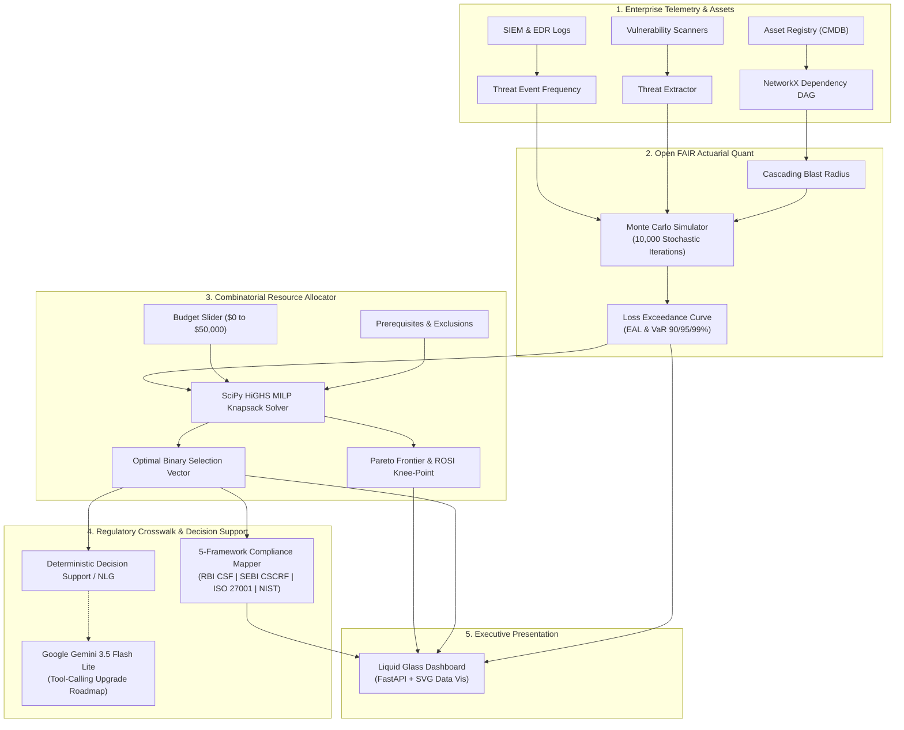
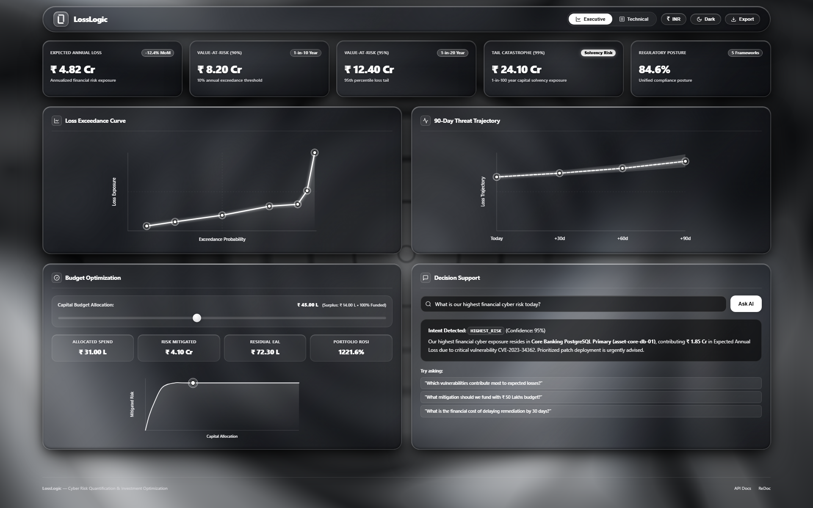

# LossLogic: Quantified Cyber Risk & Actuarial Capital Allocation Platform

[](https://www.python.org/)
[](https://fastapi.tiangolo.com/)
[](https://scipy.org/)
[](https://www.sih.gov.in/)
[](#5-multi-framework-regulatory-crosswalk)

> **Smart India Hackathon 2026** • **Problem Statement ID: 26105**  
> **Organization:** Ministry / AICTE Cyber Security Cell  
> **Theme:** Blockchain & Cybersecurity / Enterprise Risk Governance

---

## 📌 Executive Overview

In enterprise cybersecurity governance, an existential communication divide separates technical security teams (CISOs) from financial fiduciaries (CFOs, Boards of Directors, Risk Committees). Technical teams track vulnerabilities via CVEs, CVSS scores, and subjective 5×5 colored heatmaps (*"Low"*, *"Medium"*, *"High"*). In contrast, executive leadership allocates capital based on **Expected Annual Loss (EAL)**, **Value-at-Risk (VaR)**, **EBITDA protection**, and **Return on Security Investment (ROSI)**.

**LossLogic** is an enterprise-grade Cyber Risk Quantification (CRQ) and capital allocation platform that replaces subjective risk ratings with:
1. **Actuarial Financial Loss Modeling** using the **Open FAIR™ standard** (ISO/IEC 27005).
2. **Cascading Asset Failure Mapping** via a **Directed Acyclic Graph (DAG)** and blast radius multiplier.
3. **Budget-Constrained Knapsack Optimization** using **SciPy's HiGHS Mixed-Integer Linear Programming (MILP)** solver.
4. **Pareto Frontier Analytics** identifying the optimal risk-return knee-points and budget saturation thresholds.
5. **Multi-Framework Regulatory Crosswalk** mapping controls directly to **RBI CSF**, **SEBI CSCRF**, **ISO 27001**, and **NIST CSF 2.0**.

---

## 🏛️ System Architecture



---

## 🌟 Core Platform Pillars

### 1. Open FAIR™ Actuarial Monte Carlo Engine
* Runs **10,000 stochastic trials** per scenario using calibrated Beta-PERT (Threat Event Frequency & Resistance Strength) and Log-Normal (Loss Magnitude) probability distributions.
* Calculates true actuarial metrics: **Expected Annual Loss (EAL)** and tail risk percentiles (**VaR 90%**, **VaR 95%**, **VaR 99%**).

### 2. Asset Dependency Graph & Blast Radius Propagation
* Models enterprise digital infrastructure as a **Directed Acyclic Graph (DAG)** using `networkx`.
* Identifies single points of failure (Core Banking, SWIFT Gateway, Active Directory) and computes the **cascading blast radius multiplier** across downstream business services.

### 3. SciPy HiGHS Mixed-Integer Linear Programming (MILP)
* Solves the constrained 0/1 Knapsack optimization problem in real time (~4ms):
  $$\max \sum_{i=1}^n x_i \cdot \Delta\text{EAL}_i \quad \text{subject to} \quad \sum_{i=1}^n x_i \cdot \text{Cost}_i \le \text{Budget}, \quad x_i \in \{0, 1\}$$
* Enforces structural prerequisites (e.g., Multi-Factor Authentication requires an Identity & Access Management system: $x_j \le x_k$).

### 4. True Catmull-Rom Pareto Frontier
* Sweeps the budget space to construct the true non-dominated investment curve.
* Detects **Budget Saturation (Diminishing Marginal Utility)**: alerts CFOs when additional capital yields zero risk reduction and flags unallocated funds as surplus capital.

### 5. Multi-Framework Regulatory Crosswalk
* Every security control is mapped simultaneously across 5 compliance frameworks:
  * 🏦 **RBI Cyber Security Framework** (Annex-1 & Continuous Testing)
  * 📈 **SEBI CSCRF 2024** (Market Infrastructure Cyber Resilience)
  * 🌐 **ISO/IEC 27001:2022** (Information Security Management)
  * 🛡️ **NIST CSF 2.0** (Identify, Protect, Detect, Respond, Recover)
  * 🔒 **CIS Controls v8** (Implementation Groups 1, 2, 3)

### 6. Decision Support & Google Gemini AI Integration
* **Current Deterministic Engine**: Zero-hallucination regular expression query parser and Natural Language Generation (NLG) engine synthesizing live simulation vectors into board-level rationale.
* **Gemini 3.5 Flash Lite Roadmap**: Seamless upgrade via **strict Function Calling / Tool Calling schemas** where Gemini acts as the conversational orchestrator invoking Python's mathematical solver.

---

## 🖥️ User Interface Showcase

The platform features an Apple-inspired **Liquid Glass UI design system** with specular highlights, multi-layer backdrop blurs, dynamic SVG Catmull-Rom spline curves, and high-contrast telemetry.



---

## 📂 Project Structure

```
LossLogic/
├── src/
│   ├── api/                   # FastAPI application factory & REST endpoints (/api/v1/...)
│   ├── assets/                # Asset models, scoring & NetworkX dependency DAG
│   ├── compliance/            # Regulatory catalogs (RBI, SEBI, NIST, ISO) & scoring
│   ├── dashboard/             # Static web assets & Liquid Glass template
│   ├── decision_support/      # NLG financial briefings, What-If engine & threat trajectories
│   ├── optimization/          # SciPy HiGHS MILP knapsack solver & Pareto frontier
│   ├── quant/                 # Open FAIR Monte Carlo simulation engine
│   ├── telemetry/             # Multi-domain security telemetry normalizer & generator
│   └── config.py              # Enterprise global configuration & currency converters
├── tests/                     # 429 automated unit & integration test cases
├── LossLogic_Project_Report.pdf # Comprehensive 6-page project guide & pitch cheat sheet
├── requirements.txt           # Python dependencies
├── run_server.py              # Cloud & local ASGI server startup script
├── llms.txt                   # LLM & AI agent sitemap and index
├── llms-full.txt              # Complete AI context & architectural reference
├── PROJECT_CONTEXT.md         # Exhaustive developer and agent codebase reference
└── README.md                  # Project documentation
```

---

## 🚀 Quick Start (Local Development)

### 1. Prerequisites
* Python 3.11, 3.12, 3.13, or 3.14
* Git

### 2. Clone and Install
```bash
git clone https://github.com/Sourish25/LossLogic.git
cd LossLogic

# Install dependencies
pip install -r requirements.txt
```

### 3. Run the Platform
```bash
python run_server.py
```
Open your browser and navigate to:
* **Interactive Dashboard:** `http://127.0.0.1:8000/`
* **Swagger API Docs:** `http://127.0.0.1:8000/docs`
* **Health Probe:** `http://127.0.0.1:8000/api/v1/health`

### 4. Run Test Suite
```bash
pytest tests/
```
*(429 unit tests covering quant math, knapsack optimization, and compliance mapping)*

---

## ☁️ Deployment on Render (Step-by-Step)

Deploying LossLogic on Render gives you a **free, public HTTPS link** (e.g., `https://losslogic.onrender.com`) that judges can test live:

1. **Sign Up / Log In:** Go to [render.com](https://render.com/) and log in with your GitHub account.
2. **Create New Web Service:**
   * Click **New +** $\rightarrow$ **Web Service**.
   * Select your GitHub repository: `Sourish25/LossLogic`.
3. **Configure Settings:**
   * **Name:** `losslogic` (or your preferred name)
   * **Region:** Any close region (e.g., Singapore / Frankfurt)
   * **Branch:** `main`
   * **Runtime:** `Python 3`
   * **Build Command:** `pip install -r requirements.txt`
   * **Start Command:** `python run_server.py`
   * **Instance Type:** `Free`
4. **Click "Deploy Web Service"**:
   * Render will clone your repository, install packages, and launch the server.
   * Within ~2 minutes, your live link will be available at:  
     `https://<your-service-name>.onrender.com`

---

## 🤖 For AI Coding Assistants & Agents
If you clone this repository to any environment and ask an AI assistant about this project, reference:
* **`llms.txt`**: Standardized directory structure and capability index for LLMs.
* **`llms-full.txt`**: Complete consolidated technical context, algorithms, math formulas, and schemas.
* **`PROJECT_CONTEXT.md`**: Deep developer specification covering all modules, solvers, and API payloads.

---

## ⚖️ License & Attribution

Developed for **Smart India Hackathon 2026** (Problem Statement ID: 26105) by Team LossLogic.  
Built upon the **Open FAIR™ Risk Taxonomy (O-RT)** and **Open FAIR™ Risk Analysis (O-RA)** standards published by The Open Group.
